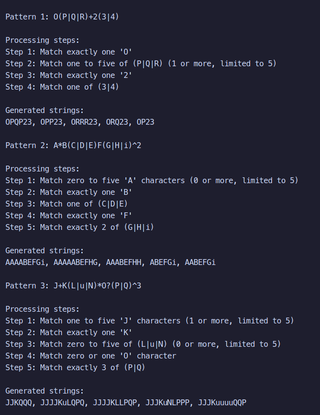

# Topic: Regular expressions

### Course: Formal Languages & Finite Automata
### Author: Rabus George    

----

## Theory
Regular expressions (regex) are symbolic notations used to describe patterns in strings. They are commonly applied in fields such as compilers, data validation, and search engines. In this project, we aim to simplify a subset of regex patterns and generate example strings that match these patterns. Additionally, we provide a step-by-step explanation of how the patterns are interpreted using basic regex constructs and quantifiers.

## Objectives:

1. Write and cover what regular expressions are, what they are used for;

2. Below you will find 3 complex regular expressions per each variant. Take a variant depending on your number in the list of students and do the following:

    a. Write a code that will generate valid combinations of symbols conform given regular expressions (examples will be shown). Be careful that idea is to interpret the given regular expressions dinamycally, not to hardcode the way it will generate valid strings. You give a set of regexes as input and get valid word as an output

    b. In case you have an example, where symbol may be written undefined number of times, take a limit of 5 times (to evade generation of extremely long combinations);

    c. **Bonus point**: write a function that will show sequence of processing regular expression (like, what you do first, second and so on)

Write a good report covering all performed actions and faced difficulties.


## Implementation description

### Regex Parsing (parse_regex)
This function reads the input regex string and converts it into a list of rule dictionaries. It supports basic quantifiers (+, *, ?, and a custom ^n) and handles character choices in parentheses like (A|B|C).

### Rule-based String Generation (generate_string_from_rules)
This function uses the parsed rules to generate strings that match the intended regex structure. It repeats or omits characters based on the quantifier or exact count provided.

### Quantifier Interpretation (determine_count)
A helper function that decides how many times a character or group should be repeated based on the quantifier attached (e.g., + means 1 to 5 times).

### Regex Explanation (explain_regex_processing)
This function provides a detailed breakdown of how the regex is interpreted rule-by-rule in plain English, making it suitable for educational purposes.

### Main Driver
Runs three test patterns, prints out the step-by-step explanations, and displays generated string outputs.

## Code snippet

```py
def parse_regex(pattern):
    """Parse a regex pattern into a list of rules"""
    ...
```
```py
def generate_string_from_rules(rules):
    """Generate a string that follows the given regex rules"""
    ...
```
```py
if __name__ == "__main__":
    patterns = [
        "O(P|Q|R)+2(3|4)",
        "A*B(C|D|E)F(G|H|i)^2",
        "J+K(L|u|N)*O?(P|Q)^3"
    ]
    
    for i, pattern in enumerate(patterns):
        ...
```



## Conclusions / Screenshots / Results

This project demonstrates how simplified regular expressions can be parsed, interpreted, and used to generate matching strings. By breaking down the regex into understandable rules and simulating quantifiers, we provide both a learning tool and a string generation utility. The implementation bridges theoretical concepts from formal languages with practical programming, reinforcing the importance of understanding how pattern-matching systems work under the hood.

Through this work, we not only deepen our understanding of regex syntax and semantics but also practice how to implement finite automata-like behavior in code. This kind of project strengthens skills in pattern recognition, control flow, and parsing—fundamental areas in both compiler design and text processing applications.

Overall, it highlights how theoretical foundations from formal languages and automata are directly applicable to real-world problems in computer science.

## References